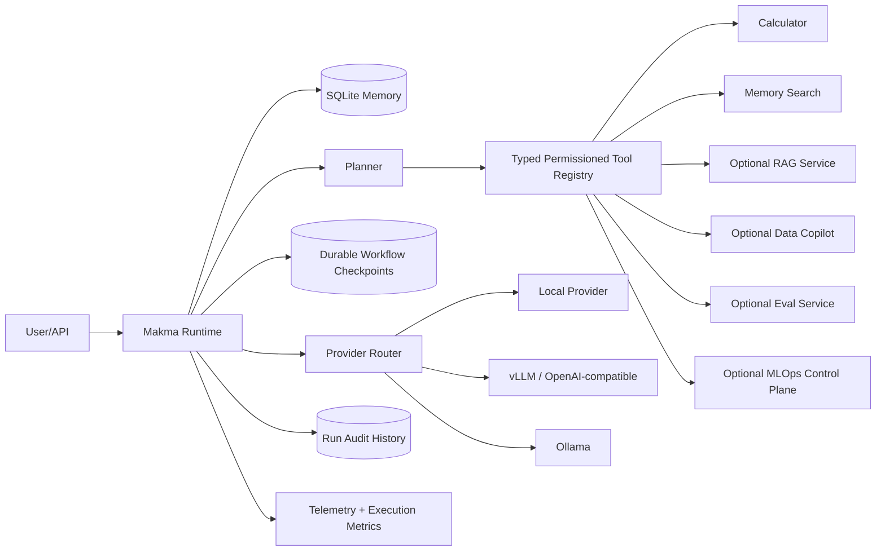

# Mak'ma AI OS

[Live Runtime Console](https://maharshimak.github.io/makma-ai-os/) · [MAK'MA Labs](https://maharshimak.github.io/makma-ai-os/projects/) · [Architecture](docs/DESIGN.md) · [API Reference](#api)

Mak'ma AI OS is a **MAK'MA Studio product** under **MAK'MA Labs**. It is a **tool-using personal AI runtime** built as an engineering portfolio project. The runtime supports deterministic, hybrid or schema-constrained model planning; local/OpenAI-compatible/Ollama providers; native provider streaming; durable run and tool-call audit history; optional hybrid semantic memory; permissioned typed tools; durable dependency-aware workflows with pause/resume approval checkpoints; and optional integration with MAK'MA RAG, Data Copilot, LLM Eval and MLOps Control Plane services.


## Product contract — engineering upgrade

**Problem and audience:** An inspectable tool runtime for engineers testing planning, permissions and session memory.

**Live tool:** https://maharshimak.github.io/makma-ai-os/

**Implemented browser workflow:** Browser: ordered remember/recall/calculator actions, measured tool latency, local approval for memory deletion, persistent conversations and run history, complete session JSON export. Connected mode retains FastAPI health verification and request timeouts.

**Backend and parity contract:** Python: SQLite session memory, optional persisted embeddings, typed tool registry and permission policy, deterministic/hybrid/model planning, provider routing, API and telemetry. Browser memory ranking and planning are separate offline implementations; no LLM is called in browser mode. All eight satellite backend revisions are pinned and fetched in CI. Behavioral Python↔browser parity fixtures are generated only for shared deterministic contracts where the implementations are intentionally equivalent.

**Architecture:** `makma-ai-os/demo` is the shared web product source and Pages deployment. This repository owns its Python domain package. The central `tests/e2e` suite exercises all nine products; `tests/fixtures/python-parity.json` plus `scripts/generate_parity.py` guard shared mathematical contracts. Backend revisions used for regeneration are pinned in the central `backend-lock.json`.

**Safety and limitations:** Browser storage is local and unencrypted; use synthetic data. Remote FastAPI access requires `MAKMA_API_TOKEN`; without a token the backend rejects non-local clients. Client-supplied approval assertions are rejected. The static browser memory-deletion approval remains a local demonstration rather than a backend authorization mechanism. No high-risk shell/filesystem/browser mutation tools are registered by default. Inputs are validated, rendered user values are escaped, and deterministic results are not presented as model inference.

**Verification:** Run `python -m ruff check .` and `python -m pytest -q`. `tests/test_engineering_upgrade.py` protects the new rejection/correctness paths. Central web checks: `npm ci`, `npm test`, `npm run build`, `npx playwright install --with-deps chromium`, `npm run test:e2e`. CI gates publishing on browser interactions and validates all public URLs after deployment.

**Highest-value next work:** Multi-user identity/session ownership, server-owned approval challenges for future high-risk tools, asynchronous persistence, OpenTelemetry export and hosted-provider integration tests.

**Provenance:** Independent MAK’MA Studio engineering implementation; examples are synthetic and no employer code or data is included. Existing MIT license applies.


## What the runtime actually implements

- provider routing for:
  - zero-config deterministic local mode
  - OpenAI-compatible `/chat/completions` servers such as vLLM or compatible gateways
  - Ollama `/api/chat`
- persistent SQLite conversation memory
- relevance-ranked lexical memory recall scoped to the current session
- optional persisted semantic embeddings with hybrid lexical/semantic session recall
- persisted run/audit history with latency, provider, success/failure state and durable per-tool traces
- deterministic ordered planning plus optional hybrid/schema-constrained model planning
- safe calculator tool with AST validation instead of `eval`
- relevance-ranked persisted-memory recall tool
- allow-list tool permission policy, enforced tool input schemas, risk metadata and approval hooks
- plan traces, persisted tool-result traces and per-run execution metrics
- optional `rag_answer`, `data_ask`, `eval_judge` and `mlops_models` read-only satellite tools when configured
- approval-gated `mlops_promote_candidate` and `mlops_promote_production` lifecycle mutation tools
- durable DAG workflows with SQLite checkpoints, dependency validation, pause/resume and explicit approval gates
- bounded runtime/provider/tool telemetry with latency and failure summaries
- FastAPI chat, tools, history, search, recall, runs, telemetry, and native provider-backed SSE streaming endpoints
- Docker support with a persistent `/app/data` volume
- offline tests that do not require API keys or external models

## Architecture



## Live runtime console

**Public console:** https://maharshimak.github.io/makma-ai-os/

The repository includes a deployable browser console in `demo/`. It exposes the runtime's planning, tool results, ranked session memory and telemetry through a restrained engineering interface.

The hosted console has two explicit modes:

- **Browser Demo Mode** — an in-browser deterministic simulation of supported calculator and memory flows, intended for immediate portfolio exploration.
- **Connected Runtime** — verifies a real Mak'ma FastAPI `/health` endpoint and then sends requests to the backend.

The browser demo is deliberately labeled and does not present simulated results as backend execution.

## Quick start

```bash
pip install -e ".[dev]"
pytest -q
uvicorn makma.main:app --reload
```

Open `http://localhost:8000/docs`.

### Docker

```bash
docker build -t makma-ai-os .
docker run --rm -p 8000:8000 -v makma-data:/app/data makma-ai-os
```

## Provider configuration

### Local zero-config mode

```bash
export MAKMA_PROVIDER=local
```

### Ollama

```bash
export MAKMA_PROVIDER=ollama
export MAKMA_BASE_URL=http://localhost:11434
export MAKMA_MODEL=qwen2.5:7b
```

### OpenAI-compatible server

```bash
export MAKMA_PROVIDER=openai
export MAKMA_BASE_URL=http://localhost:8001/v1
export MAKMA_MODEL=Qwen/Qwen2.5-7B-Instruct
export MAKMA_API_KEY=optional-if-your-server-requires-it
```

## API

- `GET /health`
- `GET /v1/tools`
- `POST /v1/chat`
- `POST /v1/chat/stream`
- `GET /v1/sessions/{session_id}/history`
- `GET /v1/sessions/{session_id}/runs`
- `GET /v1/sessions/{session_id}/search?q=...`
- `GET /v1/sessions/{session_id}/recall?q=...`
- `GET /v1/runs/{run_id}/tools`
- `GET /v1/telemetry?operation=runtime.run`
- `POST /v1/workflows/run`
- `GET /v1/workflows/{run_id}`
- `POST /v1/workflows/{run_id}/resume`

Example:

```json
{
  "message": "calculate 19 * 23",
  "session_id": "demo",
  "tools_enabled": true
}
```

The response includes the final answer, ordered plan, tool execution results, provider, run id, total latency, provider latency, aggregate tool latency and tool success/failure counts.

## Security model

Mak'ma does **not** expose arbitrary shell execution or unrestricted filesystem access. Tools are registered explicitly and checked against an allow-list before execution. The registry supports explicit-approval requirements so higher-risk tools can be introduced without silently granting them permission.

## Next engineering milestones

- browser and filesystem tools behind approval gates and sandboxes
- voice and vision adapters
- task scheduler and background workers
- OpenTelemetry export for the existing runtime telemetry surface
- optional single-user bearer-token protection today; true multi-user identity/session ownership remains future work

## Scope and limitations

The default local provider is deterministic, not an LLM. Memory remains lexical by default; semantic recall activates only when a compatible embedding endpoint/model is configured. OpenAI-compatible and Ollama providers stream native chunks; the local deterministic provider emits one chunk. Remote access is blocked unless `MAKMA_API_TOKEN` is configured, but the token represents a single owner rather than full multi-user identity/session ownership. Client-supplied approvals are rejected by the public chat schema. High-risk lifecycle operations are instead exposed through the durable workflow API, where a run can pause at an approval checkpoint and resume explicitly with the approved tool name. Run history and individual tool traces persist in SQLite. Telemetry is bounded and in-memory. Core SQLite operations remain synchronous under an asyncio lock. No shell, filesystem, browser or autonomous background execution is registered.

## Installation and development

Requires Python 3.12 or newer. Run from this project directory.

```bash
python -m venv .venv
source .venv/bin/activate
python -m pip install -e ".[dev]"
python -m ruff check .
python -m pytest -q
python -m pip wheel --no-deps . -w dist
```

On Windows, activate with `.venv\Scripts\Activate.ps1`.

## Library usage

```python
import asyncio
from makma.runtime import build_runtime

runtime = build_runtime()
result = asyncio.run(runtime.run("calculate 19 * 23", "demo"))
print(result.response)
runtime.memory.close()
```

## Configuration

See [.env.example](.env.example). Export variables into the process environment; the application does not automatically load that file. Keep real credentials out of Git.

## Service and API schema

```bash
python -m uvicorn makma.main:app --host 127.0.0.1 --port 8000
```

Interactive endpoint schemas are at `http://127.0.0.1:8000/docs`; machine-readable schemas are at `/openapi.json`. Set `MAKMA_API_TOKEN` to authorize remote access with `Authorization: Bearer <token>`. If no token is configured, runtime data/tool endpoints reject non-local clients.

## Container

```bash
docker build -t makma-ai-os .
docker run --rm -p 127.0.0.1:8000:8000 -v makma-data:/app/data makma-ai-os
```

## Repository structure

| Path | Purpose |
| --- | --- |
| `src/makma/` | Implementation |
| `tests/` | Offline unit and regression tests |
| `docs/DESIGN.md` | Architecture and trust boundaries |
| `demo/` | Professional browser runtime console |
| `.github/workflows/ci.yml` | Install, lint, tests, wheel and container build |
| `.github/workflows/pages.yml` | Static console deployment to GitHub Pages |
| `pyproject.toml` | Dependencies and package configuration |

## Next engineering work

Multi-user identity/session ownership; OpenTelemetry export; multi-user approval identity and signed approval challenges; isolated workers for future higher-risk tools; provider connection pooling/retry policy; and richer hosted integration testing. These are planned work, not current capabilities.

## Contributing and security

See [CONTRIBUTING.md](CONTRIBUTING.md) and [SECURITY.md](SECURITY.md). CI runs on every push and pull request through `.github/workflows/ci.yml`.

## License and provenance

[MIT](LICENSE), copyright 2026 Maharshi Patel. This public portfolio implementation is independent of employer systems and contains no confidential employer code or data. Examples and test fixtures are synthetic.
