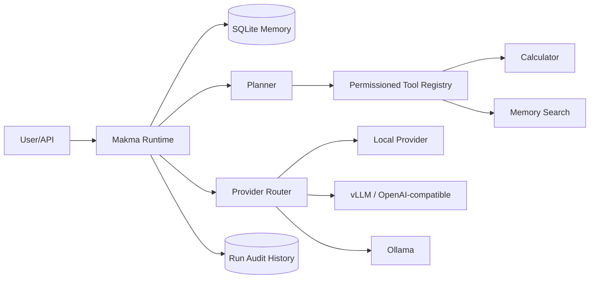

# 🦾 Mak'ma AI OS

Mak'ma is a **tool-using personal AI runtime** built as an engineering portfolio project. V2 replaces the original single-file echo demo with a modular runtime that can route to local or OpenAI-compatible models, persist conversation state, plan auditable tool calls, enforce permissions, and expose the system through a FastAPI service.

## What V2 actually implements

- provider routing for:
  - zero-config deterministic local mode
  - OpenAI-compatible `/chat/completions` servers such as vLLM or compatible gateways
  - Ollama `/api/chat`
- persistent SQLite conversation memory
- persisted run/audit history with latency and provider metadata
- deterministic planner for auditable tool use
- safe calculator tool with AST validation instead of `eval`
- persisted-memory search tool
- allow-list tool permission policy and approval hooks
- plan traces and tool-result traces returned with every chat run
- FastAPI chat, tools, history, search, runs, and SSE streaming endpoints
- Docker support with a persistent `/app/data` volume
- offline tests that do not require API keys or external models

## Architecture



## Quick start

```bash
pip install -e ".[dev]"
pytest -q
uvicorn makma.main:app --reload
```

Open `http://localhost:8000/docs`.

### Docker

```bash
docker build -t makma-ai-os .
docker run --rm -p 8000:8000 -v makma-data:/app/data makma-ai-os
```

## Provider configuration

### Local zero-config mode

```bash
export MAKMA_PROVIDER=local
```

### Ollama

```bash
export MAKMA_PROVIDER=ollama
export MAKMA_BASE_URL=http://localhost:11434
export MAKMA_MODEL=qwen2.5:7b
```

### OpenAI-compatible server

```bash
export MAKMA_PROVIDER=openai
export MAKMA_BASE_URL=http://localhost:8001/v1
export MAKMA_MODEL=Qwen/Qwen2.5-7B-Instruct
export MAKMA_API_KEY=optional-if-your-server-requires-it
```

## API

- `GET /health`
- `GET /v1/tools`
- `POST /v1/chat`
- `POST /v1/chat/stream`
- `GET /v1/sessions/{session_id}/history`
- `GET /v1/sessions/{session_id}/runs`
- `GET /v1/sessions/{session_id}/search?q=...`

Example:

```json
{
  "message": "calculate 19 * 23",
  "session_id": "demo",
  "tools_enabled": true,
  "approvals": []
}
```

The response includes the final answer, the plan, tool execution results, provider, run id, and measured latency.

## Security model

Mak'ma does **not** expose arbitrary shell execution or unrestricted filesystem access. Tools are registered explicitly and checked against an allow-list before execution. The registry supports explicit-approval requirements so higher-risk tools can be introduced without silently granting them permission.

## Next engineering milestones

- native model streaming instead of response-token replay
- richer LLM-generated structured planning with schema validation
- vector/semantic long-term memory
- browser and filesystem tools behind approval gates and sandboxes
- voice and vision adapters
- task scheduler and background workers
- OpenTelemetry traces and metrics
- dedicated web UI

## Scope and limitations

The default local provider is deterministic, not an LLM. SSE replays a completed answer rather than streaming model tokens. Sessions are identifiers, not authentication boundaries. API-provided approvals are intended for a trusted local client, not multi-user authorization. Run history persists responses and metadata; full tool traces are returned with the response, not persisted. SQLite operations are synchronous. No shell, filesystem, browser or autonomous background execution is implemented.

## Installation and development

Requires Python 3.12 or newer. Run from this project directory.

```bash
python -m venv .venv
source .venv/bin/activate
python -m pip install -e ".[dev]"
python -m ruff check .
python -m pytest -q
python -m pip wheel --no-deps . -w dist
```

On Windows, activate with `.venv\Scripts\Activate.ps1`.

## Library usage

```python
import asyncio
from makma.runtime import build_runtime

runtime = build_runtime()
result = asyncio.run(runtime.run("calculate 19 * 23", "demo"))
print(result.response)
runtime.memory.close()
```

## Configuration

See [.env.example](.env.example). Export variables into the process environment; the application does not automatically load that file. Keep real credentials out of Git.

## Service and API schema

```bash
python -m uvicorn makma.main:app --host 127.0.0.1 --port 8000
```

Interactive endpoint schemas are at `http://127.0.0.1:8000/docs`; machine-readable schemas are at `/openapi.json`. These APIs have no built-in authentication. Use trusted local data and local access.

## Container

```bash
docker build -t makma-ai-os .
docker run --rm -p 127.0.0.1:8000:8000 -v makma-data:/app/data makma-ai-os
```

## Repository structure

| Path | Purpose |
| --- | --- |
| `src/makma/` | Implementation |
| `tests/` | Offline unit and regression tests |
| `docs/DESIGN.md` | Architecture and trust boundaries |
| `.github/workflows/ci.yml` | Install, lint, tests, wheel and container build |
| `pyproject.toml` | Dependencies and package configuration |

## Next engineering work

Authenticated sessions; durable tool traces; native provider streaming; structured model planning; isolated workers for any future higher-risk tools. These are planned work, not current capabilities.

## Contributing and security

See [CONTRIBUTING.md](CONTRIBUTING.md) and [SECURITY.md](SECURITY.md). The standalone CI workflow runs after migration; while nested in the profile repository, the parent CI validates this project.

## License and provenance

[MIT](LICENSE), copyright 2026 Maharshi Patel. This public portfolio implementation is independent of employer systems and contains no confidential employer code or data. Examples and test fixtures are synthetic.
